# How to Analyze and Predict Late Delivery Risk Using Machine Learning

## Introduction

Every year, late deliveries cost logistics companies billions of dollars — not just in refunds and penalties, but in something harder to recover: **customer trust**. According to industry reports, over 60% of customers who experience a late delivery won't shop with the same vendor again. Yet for most logistics teams, the response is reactive: a package is late, a customer complains, and only then does someone investigate.

What if we could flip that script? What if, **at the moment an order is placed**, a system could flag it as high-risk and alert the operations team to intervene — before the delay ever happens?

That's exactly what this project builds: a **Late Delivery Risk Prediction** system trained on 180,000+ real supply chain orders, wrapped in a FastAPI backend and a Next.js frontend. By the end of this article, you'll understand how to take a raw logistics dataset all the way from exploratory analysis to a live prediction API.

---

## 1. Problem Definition & Scope Identification

### 1.1. Problem Identification

This is a **binary classification** problem. Given information available *at order placement time*, we want to predict:

- **0** → On Time
- **1** → Late

The critical constraint: **no data leakage**. Many notebooks online achieve 97%+ accuracy on this dataset by accidentally including `Days for shipping (real)` or `Delivery Status` as features — columns that are only known *after* delivery. We deliberately exclude all of them.

> A model that cheats with post-delivery data is useless in production. A model with 60% accuracy using only pre-shipment data is genuinely valuable.

### 1.2. Evaluation Metrics

Since this is a classification problem with business consequences, we prioritize metrics carefully:

| Metric | Formula | Why it matters |
|---|---|---|
| **Recall (Late class)** | TP / (TP + FN) | Missing a late order (false negative) is costly — no intervention happens |
| **Precision** | TP / (TP + FP) | Too many false alarms wastes ops team bandwidth |
| **AUC-ROC** | Area under ROC curve | Measures overall discrimination ability across all thresholds |
| **Accuracy** | Correct / Total | Useful but secondary — class imbalance makes it misleading alone |

> **Recall is our north star.** In logistics, a missed late delivery (false negative) is far more damaging than a false alarm (false positive). We tune threshold accordingly.

### 1.3. Questions to Answer

Before modeling, we define what EDA needs to answer:

1. How imbalanced is the target class?
2. Which shipping modes carry the highest late-delivery risk?
3. Does geography (market/region) affect delivery reliability?
4. Are there time-based patterns (monthly, day-of-week)?
5. Which numerical features correlate with the target?

---

## 2. Data Collection

**Dataset:** [DataCo Smart Supply Chain — Kaggle](https://www.kaggle.com/datasets/shashwatwork/dataco-smart-supply-chain-for-big-data-analysis)

```
Shape: 180,519 rows × 53 columns
```

The dataset covers orders across 5 global markets (LATAM, Europe, Pacific Asia, USCA, Africa) with features spanning shipping logistics, customer segments, product categories, and financial metrics.

**Loading note:** The file uses Windows-1252 encoding — a common gotcha that causes errors if you load with default UTF-8:

```python
df = pd.read_csv('dataset/DataCoSupplyChainDataset.csv', encoding='cp1252')
```

**Key columns overview:**

| Group | Columns | Available at order time? |
|---|---|---|
| Shipping | `Shipping Mode`, `Days for shipment (scheduled)` | ✅ Yes |
| Geography | `Market`, `Order Region` | ✅ Yes |
| Product | `Category Name`, `Department Name` | ✅ Yes |
| Customer | `Customer Segment` | ✅ Yes |
| Financial | `Benefit per order`, `Order Item Discount Rate` | ✅ Yes |
| **Leakage** | `Days for shipping (real)`, `Delivery Status`, `shipping date` | ❌ **No — exclude** |

---

## 3. Exploratory Data Analysis (EDA)

### 3.1. Load and Initial Data Exploration

```python
df = pd.read_csv('dataset/DataCoSupplyChainDataset.csv', encoding='cp1252')
print(df.shape)         # (180519, 53)
print(df.dtypes.value_counts())
# object     24
# float64    15
# int64      14
```

### 3.2. Finding Data Problems

#### 3.2.1. Check for Missing Data

```python
df.isnull().sum().sort_values(ascending=False).head(5)
# Product Description    180519  ← 100% missing, useless
# Order Zipcode          155679  ← 86% missing, drop
# Customer Lname              8  ← negligible
# Customer Zipcode            3  ← negligible
```

`Product Description` is entirely empty across all 180,519 rows — it contributes zero signal and gets dropped immediately. `Order Zipcode` is missing 86% of the time, making it unreliable as a feature.

The columns we actually care about for modeling have **no missing values at all** — a pleasant surprise that reduces our cleaning workload significantly.

#### 3.2.2. Leakage Check

This is the most important data quality check in this project. We systematically ask: *"Can we know this at the time the order is placed?"*

```python
LEAKAGE_COLS = [
    'Days for shipping (real)',   # only known after delivery
    'Delivery Status',            # only known after delivery
    'shipping date (DateOrders)', # only known after dispatch
]
# These columns are NEVER used as features
```

> Removing leakage features drops accuracy from ~97% to ~60% — but that 60% is real, production-ready accuracy.

### 3.3. Target Distribution

```python
df['Late_delivery_risk'].value_counts(normalize=True)
# 1 (Late)     0.5483  →  54.83%
# 0 (On Time)  0.4517  →  45.17%
```

The dataset is slightly imbalanced toward `Late`. This is actually good news — it means late deliveries are common enough to learn from. We use `class_weight='balanced'` in our model to handle this.

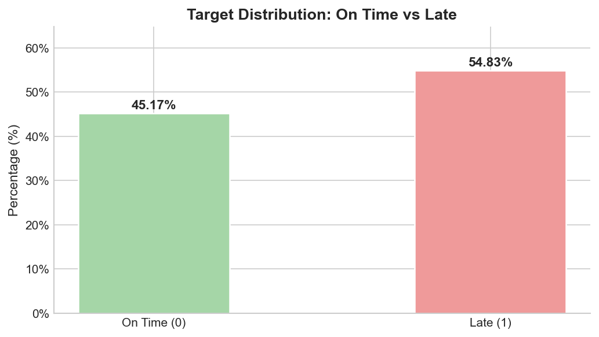

### 3.4. Distribution Analysis of Variables

#### Shipping Mode vs Late Risk

```python
df.groupby('Shipping Mode')['Late_delivery_risk'].mean().sort_values(ascending=False) * 100
```

Different shipping modes show meaningfully different late-delivery rates — making `Shipping Mode` one of the strongest categorical signals in the dataset. Intuitively, this makes sense: same-day delivery operates under very different logistics pressure than standard class.

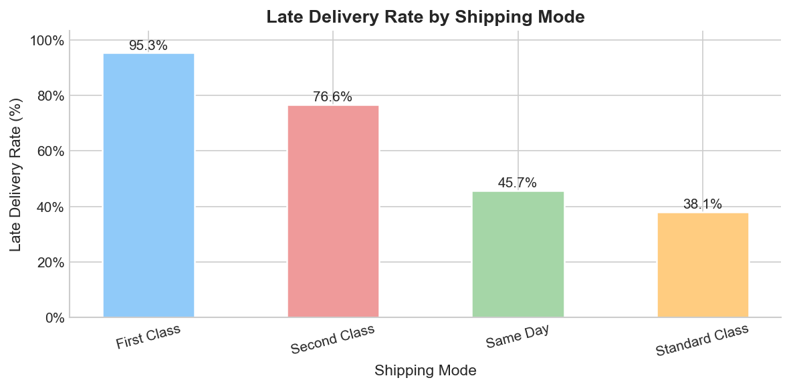

#### Market vs Late Risk

```python
df.groupby('Market')['Late_delivery_risk'].mean().sort_values(ascending=False) * 100
```

Late rates vary across the 5 global markets, suggesting that regional logistics infrastructure plays a real role in delivery reliability.

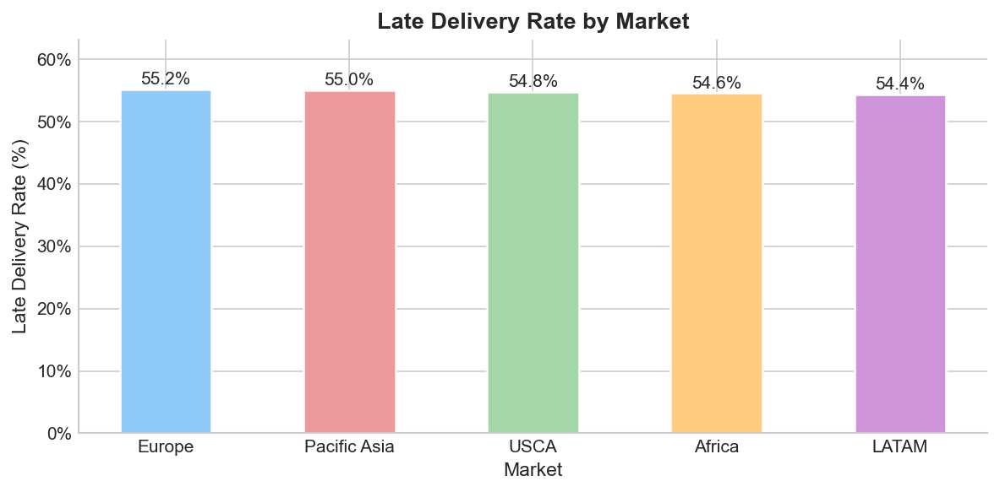

Looking deeper, we can cross-reference **product category against market** to find which combinations carry the highest risk:

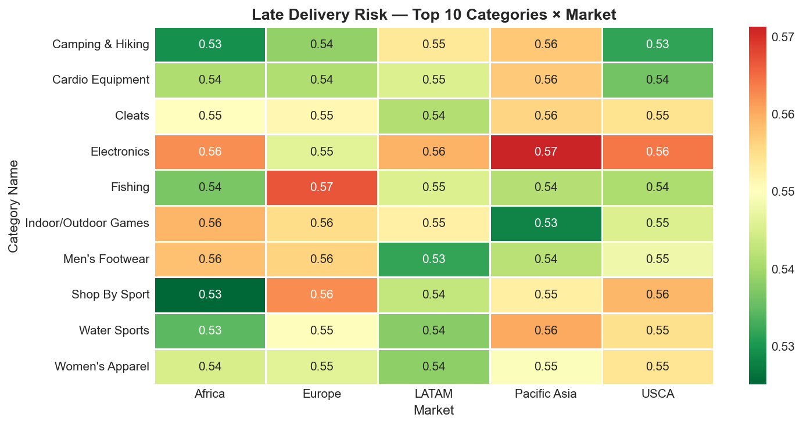

### 3.5. Relationship between Features and Target

#### Time Features

```python
df['Month'] = pd.to_datetime(df['order date (DateOrders)']).dt.month
monthly_late = df.groupby('Month')['Late_delivery_risk'].mean() * 100
# Range: 54.06% (July) to 55.79% (August) — overall avg: 54.83%
```

One interesting finding: **Q4 (Oct–Dec) is NOT a peak season in this dataset.** Despite common intuition about Black Friday and Christmas driving delivery delays, late rates in October–December are actually slightly *below* average. This makes sense given the dataset's B2B supply chain nature — corporate bulk orders operate on fixed schedules, not consumer shopping cycles.

> This is why EDA matters: domain assumptions must be verified against actual data before being encoded as features.

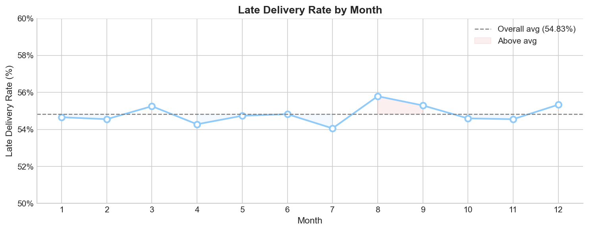

The day-of-week pattern is similarly flat — no single day stands out as dramatically riskier:

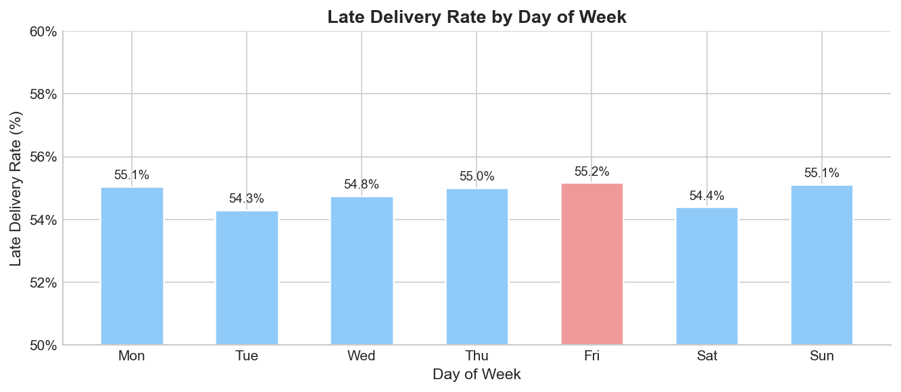

#### Scheduled Days vs Late Risk

```python
df.groupby('Late_delivery_risk')['Days for shipment (scheduled)'].describe()
```

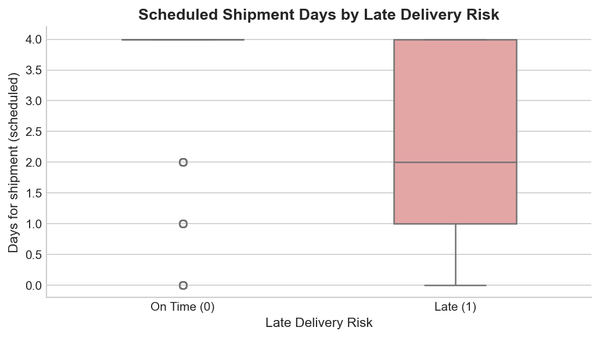

#### Correlation Heatmap

```python
corr_cols = [
    'Days for shipment (scheduled)', 'Benefit per order',
    'Order Item Discount Rate', 'Month', 'Day_of_Week',
    'Late_delivery_risk',
]
df[corr_cols].corr()
```

Numerical features show modest but consistent correlations with the target — none dominantly predictive on their own, which is why we need a non-linear ensemble model.

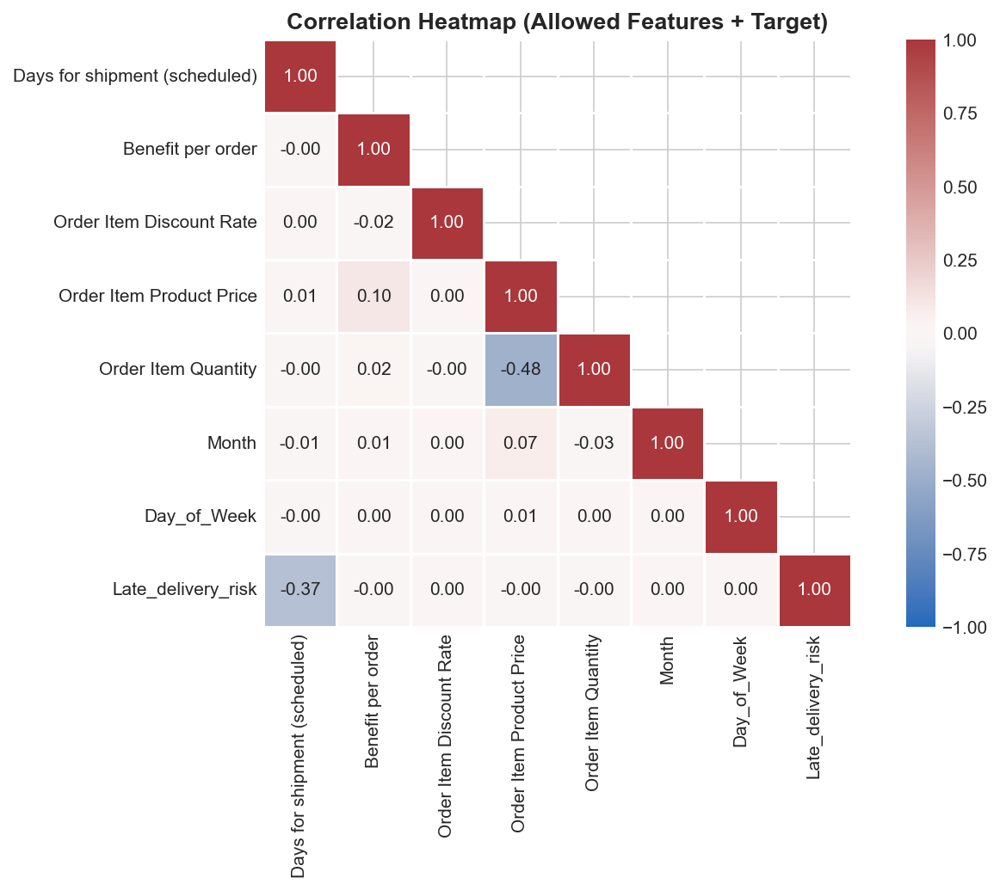

---

## 4. Feature Engineering

### 4.1. Remove Unnecessary Features

We keep only 10 raw columns out of 53, strictly filtered to what's knowable at order time:

```python
FEATURE_COLS = [
    'Shipping Mode',
    'Days for shipment (scheduled)',
    'Market',
    'Order Region',
    'Category Name',
    'Customer Segment',
    'Department Name',
    'order date (DateOrders)',
    'Benefit per order',
    'Order Item Discount Rate',
]
TARGET = 'Late_delivery_risk'
```

### 4.2. Classify and Organize Features

| Type | Columns | Treatment |
|---|---|---|
| Categorical (enum) | `Shipping Mode`, `Market`, `Customer Segment` | Label Encoding + save mapping |
| Categorical (high-cardinality) | `Order Region`, `Category Name`, `Department Name` | Label Encoding + save mapping |
| Numerical (scale needed) | `Days for shipment (scheduled)`, `Benefit per order`, `Order Item Discount Rate` | StandardScaler |
| Datetime | `order date (DateOrders)` | Feature extraction → drop |

### 4.3. Building New Features

From the single datetime column, we extract four time-based features:

```python
df['Month']          = df['order date (DateOrders)'].dt.month        # 1–12
df['Day_of_Week']    = df['order date (DateOrders)'].dt.dayofweek    # 0=Mon, 6=Sun
df['Quarter']        = df['order date (DateOrders)'].dt.quarter      # 1–4
df['Is_Peak_Season'] = df['Month'].isin([10, 11, 12]).astype(int)    # domain hypothesis

# Drop original date column after extraction
df.drop(columns=['order date (DateOrders)'], inplace=True)
```

Note: `Is_Peak_Season` was created as a domain hypothesis (Q4 = peak logistics season). EDA revealed it has **no signal in this dataset** — feature importance ranks it 13th out of 13. It's kept for completeness but contributes negligibly to predictions.

### 4.4. Encoding and Scaling

**Categorical → Label Encoding** with saved mapping for inference consistency:

```python
from sklearn.preprocessing import LabelEncoder
import json

CAT_COLS = ['Shipping Mode', 'Market', 'Order Region',
            'Category Name', 'Customer Segment', 'Department Name']

encoding_map = {}
for col in CAT_COLS:
    le = LabelEncoder()
    df[col + '_enc'] = le.fit_transform(df[col].astype(str))
    encoding_map[col] = {str(cls): int(idx) for idx, cls in enumerate(le.classes_)}

# Save mapping — backend will use this at inference time
with open('backend/ml/encoding_map.json', 'w') as f:
    json.dump(encoding_map, f, indent=2)
```

> Saving `encoding_map.json` is critical. If the API re-encodes categories differently from training, predictions become meaningless — garbage in, garbage out.

**Numerical → StandardScaler** (fit on train set only):

```python
from sklearn.preprocessing import StandardScaler

NUM_COLS = ['Days for shipment (scheduled)', 'Benefit per order', 'Order Item Discount Rate']
scaler = StandardScaler()

X_train[NUM_COLS] = scaler.fit_transform(X_train[NUM_COLS])  # fit only on train
X_val[NUM_COLS]   = scaler.transform(X_val[NUM_COLS])        # transform only
X_test[NUM_COLS]  = scaler.transform(X_test[NUM_COLS])       # transform only

joblib.dump(scaler, 'backend/ml/scaler.pkl')
```

**Final feature set — 13 features:**

```python
FINAL_FEATURES = [
    'Shipping Mode_enc', 'Days for shipment (scheduled)',
    'Market_enc', 'Order Region_enc', 'Category Name_enc',
    'Customer Segment_enc', 'Department Name_enc',
    'Month', 'Day_of_Week', 'Is_Peak_Season', 'Quarter',
    'Benefit per order', 'Order Item Discount Rate',
]
```

**Train / Val / Test split — 70 / 15 / 15:**

```python
from sklearn.model_selection import train_test_split

X_train, X_temp, y_train, y_temp = train_test_split(X, y, test_size=0.30,
                                                      random_state=42, stratify=y)
X_val, X_test, y_val, y_test     = train_test_split(X_temp, y_temp, test_size=0.50,
                                                      random_state=42, stratify=y_temp)
# Train: 126,363 | Val: 27,078 | Test: 27,078
```

`stratify=y` ensures the 54.83% / 45.17% class ratio is preserved identically across all three splits.

---

## 5. Model Training

### 5.1. Data Preparation

Before training, we verify that feature order matches exactly between splits and `feature_names.json`:

```python
with open('backend/ml/feature_names.json') as f:
    feature_names = json.load(f)

X_train = X_train[feature_names]  # enforce exact order
X_val   = X_val[feature_names]
X_test  = X_test[feature_names]
```

Feature order must be consistent between training and inference. Swapping even two columns silently produces wrong predictions with no error thrown.

### 5.2. Threshold Tuning

We use **threshold = 0.3** instead of the default 0.5. This shifts the decision boundary toward catching more late deliveries (higher Recall), at the cost of some Precision:

```python
THRESHOLD = 0.3

y_prob = model.predict_proba(X_val)[:, 1]
y_pred = (y_prob >= THRESHOLD).astype(int)  # predict Late if prob >= 0.3
```

The business rationale: missing a late delivery (false negative) is far costlier than a false alarm (false positive). An ops team can handle extra alerts; unhappy customers are harder to recover.

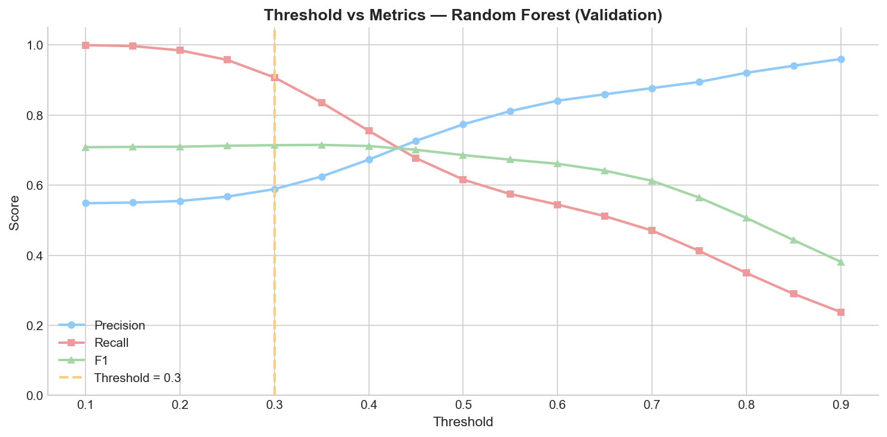

The chart shows threshold=0.3 sits at the point where Recall is still high while F1 hasn't collapsed — a good operating point for this business problem.

### 5.3. Models Used

**Baseline: Logistic Regression**

```python
from sklearn.linear_model import LogisticRegression

lr = LogisticRegression(max_iter=1000, random_state=42)
lr.fit(X_train, y_train)
```

**Final Model: Random Forest**

```python
from sklearn.ensemble import RandomForestClassifier

rf = RandomForestClassifier(
    n_estimators=100,
    min_samples_split=5,
    class_weight='balanced',   # handles 54/46 class imbalance
    random_state=42,
    n_jobs=-1,
)
rf.fit(X_train, y_train)
```

### 5.4. Results

**Test set evaluation (threshold = 0.3):**

| Metric | Logistic Regression | Random Forest |
|---|---|---|
| Accuracy | 54.83% | **60.27%** |
| Recall (Late) | 100.00% | **90.44%** |
| Precision | 54.83% | **58.98%** |
| F1 Score | 70.82% | **71.39%** |
| AUC-ROC | 0.7150 | **0.7466** |

Random Forest wins on every metric except Recall — but that's a Logistic Regression edge case: at threshold=0.3, LR flags *everything* as Late (100% Recall, 0% On Time predictions), which is not practically useful. Random Forest gives a better trade-off.

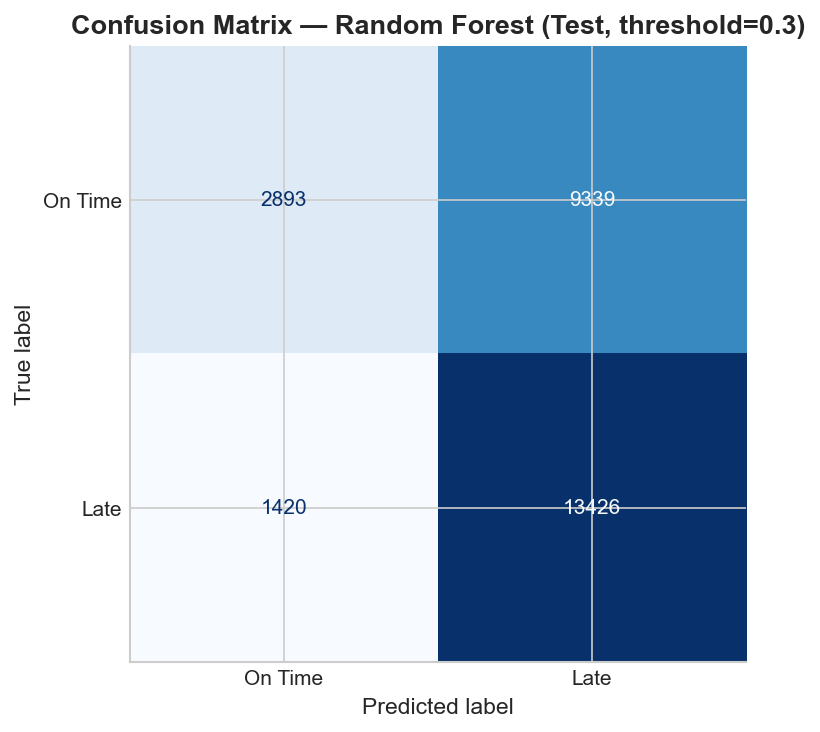

**Feature Importance (Random Forest):**

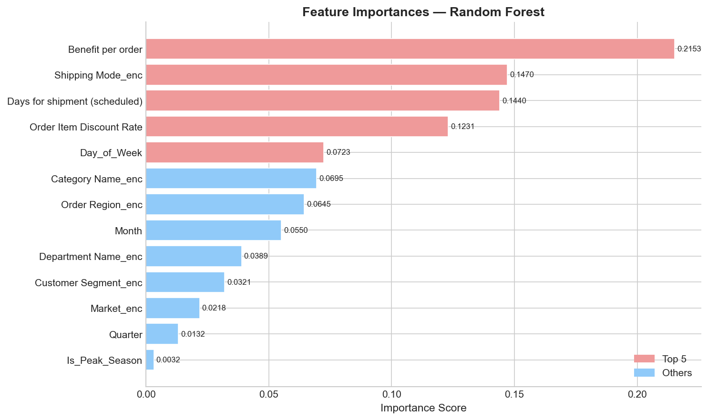

| Rank | Feature | Importance |
|---|---|---|
| 1 | Benefit per order | 0.2153 |
| 2 | Shipping Mode | 0.1470 |
| 3 | Days for shipment (scheduled) | 0.1440 |
| 4 | Order Item Discount Rate | 0.1231 |
| 5 | Day of Week | 0.0723 |
| ... | ... | ... |
| 13 | Is_Peak_Season | 0.0032 |

`Benefit per order` being the top feature is an interesting finding — orders with higher profit margins may be handled with different logistics priority. Shipping Mode and scheduled days are more intuitive top predictors.

**Export final model:**

```python
import joblib, json

joblib.dump(rf, 'backend/ml/model.pkl')

with open('backend/ml/model_config.json', 'w') as f:
    json.dump({
        'model_type': 'RandomForestClassifier',
        'threshold': THRESHOLD,
        'n_features': len(feature_names),
        'feature_names': feature_names,
    }, f, indent=2)
```

---

## 6. Model Deployment

The model is served through a **FastAPI backend** consumed by a **Next.js frontend**. The two services communicate over a single REST endpoint.

### 6.1. Architecture Overview

```
User fills order form (Next.js)
    │
    ▼  POST /api/v1/predict
FastAPI Backend
    │  ① Validate input (Pydantic)
    │  ② Encode categoricals (encoding_map.json)
    │  ③ Scale numericals (scaler.pkl)
    │  ④ Build feature vector (feature_names.json)
    │  ⑤ model.predict_proba()
    │  ⑥ Apply threshold=0.3
    ▼
JSON Response → { prediction, risk_score, label, risk_level }
    │
    ▼
ResultCard (Next.js) displays risk badge + gauge
```

### 6.2. FastAPI Backend

**Input / Output Schema (Pydantic):**

```python
from pydantic import BaseModel, Field
from typing import Literal

class PredictionInput(BaseModel):
    shipping_mode:     Literal["First Class", "Same Day", "Second Class", "Standard Class"]
    scheduled_days:    int   = Field(ge=1, le=30)
    market:            Literal["LATAM", "Europe", "Pacific Asia", "USCA", "Africa"]
    order_region:      str
    category_name:     str
    customer_segment:  Literal["Consumer", "Corporate", "Home Office"]
    department_name:   str
    order_month:       int   = Field(ge=1, le=12)
    order_day_of_week: int   = Field(ge=0, le=6)
    benefit_per_order: float
    discount_rate:     float = Field(ge=0.0, le=1.0)

class PredictionOutput(BaseModel):
    prediction:     int    # 0 or 1
    risk_score:     float  # 0.0 – 100.0
    label:          str    # "On Time" or "Late"
    risk_level:     str    # "Low" / "Medium" / "High"
    threshold_used: float
```

Pydantic validates every incoming request automatically — wrong enum values, out-of-range numbers, or missing fields return a `422 Unprocessable Entity` before the model ever runs.

**Inference Service:**

The key design decision is loading all artifacts once at server startup, not on every request:

```python
class MLService:
    def __init__(self):
        self.model         = joblib.load('ml/model.pkl')
        self.scaler        = joblib.load('ml/scaler.pkl')
        self.encoding_map  = json.load(open('ml/encoding_map.json'))
        self.feature_names = json.load(open('ml/feature_names.json'))
        self.threshold     = 0.3
        self.is_loaded     = True

    def predict(self, input_data: PredictionInput) -> dict:
        # Build feature vector in exact training order
        features   = self._build_features(input_data)
        feature_df = pd.DataFrame([features], columns=self.feature_names)

        # Scale numerical columns using saved scaler
        feature_df[NUM_COLS] = self.scaler.transform(feature_df[NUM_COLS])

        # Predict probability and apply threshold
        probability = float(self.model.predict_proba(feature_df)[0][1])
        prediction  = int(probability >= self.threshold)
        risk_score  = round(probability * 100.0, 2)

        risk_level = "High" if risk_score >= 70 else "Medium" if risk_score >= 40 else "Low"

        return {
            "prediction":     prediction,
            "risk_score":     risk_score,
            "label":          "Late" if prediction == 1 else "On Time",
            "risk_level":     risk_level,
            "threshold_used": self.threshold,
        }

ml_service = MLService()  # singleton — loaded once at startup
```

**API Endpoint:**

```python
from fastapi import APIRouter, HTTPException

router = APIRouter()

@router.post("/predict", response_model=PredictionOutput)
def predict_delivery(payload: PredictionInput) -> PredictionOutput:
    try:
        result = ml_service.predict(payload)
        return PredictionOutput(**result)
    except RuntimeError as exc:
        raise HTTPException(status_code=500, detail=str(exc))
```

**CORS Configuration** (required for Next.js on port 3000):

```python
app.add_middleware(
    CORSMiddleware,
    allow_origins=["http://localhost:3000"],
    allow_methods=["*"],
    allow_headers=["*"],
)
```

**Run the server:**

```bash
cd backend
uvicorn app.main:app --reload --port 8000
# Swagger UI → http://localhost:8000/docs
```

### 6.3. Next.js Frontend

The frontend provides a two-panel interface: an order input form on the left, and a risk result card on the right.

**API call from the browser:**

```typescript
// lib/api.ts
const BASE_URL = process.env.NEXT_PUBLIC_API_URL ?? 'http://localhost:8000'

export async function predictDelivery(input: PredictionInput): Promise<PredictionOutput> {
  const res = await fetch(`${BASE_URL}/api/v1/predict`, {
    method:  'POST',
    headers: { 'Content-Type': 'application/json' },
    body:    JSON.stringify(input),
  })

  if (!res.ok) {
    const err = await res.json()
    throw new Error(err.detail ?? 'Prediction failed')
  }

  return res.json()
}
```

**UI State management:**

```typescript
type UIState = 'idle' | 'loading' | 'success' | 'error'

// idle    → empty form, waiting for submit
// loading → spinner while fetching
// success → ResultCard appears with prediction
// error   → "Cannot connect to server" message
```

**Result Card** displays the prediction with color-coded risk levels:

```typescript
const riskConfig = {
  Low:    { color: 'green',  message: '✅ This order is likely to arrive on time.' },
  Medium: { color: 'yellow', message: '⚠️ Moderate delay risk. Monitor this order.' },
  High:   { color: 'red',    message: '🚨 High delay risk. Consider proactive action.' },
}
```

**Important frontend notes:**

- `discount_rate`: accept user input as percentage (0–100), divide by 100 before sending to API
- `order_day_of_week`: display Mon/Tue/.../Sun but send 0–6 to backend
- `risk_score`: round to 1 decimal place for display

**Run the frontend:**

```bash
cd frontend
npm install
npm run dev
# → http://localhost:3000
```

### 6.4. End-to-End Test

```bash
curl -X POST http://localhost:8000/api/v1/predict \
  -H "Content-Type: application/json" \
  -d '{
    "shipping_mode": "First Class",
    "scheduled_days": 5,
    "market": "LATAM",
    "order_region": "Central America",
    "category_name": "Cleats",
    "customer_segment": "Consumer",
    "department_name": "Fan Shop",
    "order_month": 11,
    "order_day_of_week": 2,
    "benefit_per_order": 50.0,
    "discount_rate": 0.1
  }'

# Response:
# {
#   "prediction": 1,
#   "risk_score": 64.02,
#   "label": "Late",
#   "risk_level": "Medium",
#   "threshold_used": 0.3
# }
```

---

## Conclusion

We built a complete late delivery risk prediction system, from a raw 180K-row supply chain dataset to a live REST API with a web interface. Here are the key takeaways from this project:

**1. Leakage prevention is non-negotiable.** Dropping post-delivery features dropped accuracy from ~97% to ~60% — but that 60% is real. A model that "cheats" offers no production value.

**2. Threshold tuning matters more than model selection.** Moving from threshold=0.5 to threshold=0.3 dramatically improved Recall for the Late class, aligning the model with business priorities.

**3. Domain assumptions must be data-verified.** We hypothesized Q4 was a peak season — EDA disproved it. `Is_Peak_Season` ended up as the lowest-importance feature (rank 13/13). Always let data validate your assumptions.

**4. Artifact consistency is the glue between training and serving.** `encoding_map.json`, `feature_names.json`, and `scaler.pkl` must be generated during training and loaded identically at inference. Any mismatch silently corrupts predictions.

**5. Separation of concerns keeps the system maintainable.** FastAPI handles ML serving with strict schema validation. Next.js handles user interaction. They communicate through a clean API contract — either side can evolve independently.

The model achieves **AUC-ROC of 0.747** and **Recall of 90.4%** on held-out test data using only information available at order placement time. For a logistics team, this means catching 9 out of 10 at-risk shipments before they become a customer complaint.

---

*Built with: Python · scikit-learn · FastAPI · Next.js · Tailwind CSS*
*Dataset: DataCo Smart Supply Chain (Kaggle) — 180,519 orders*
